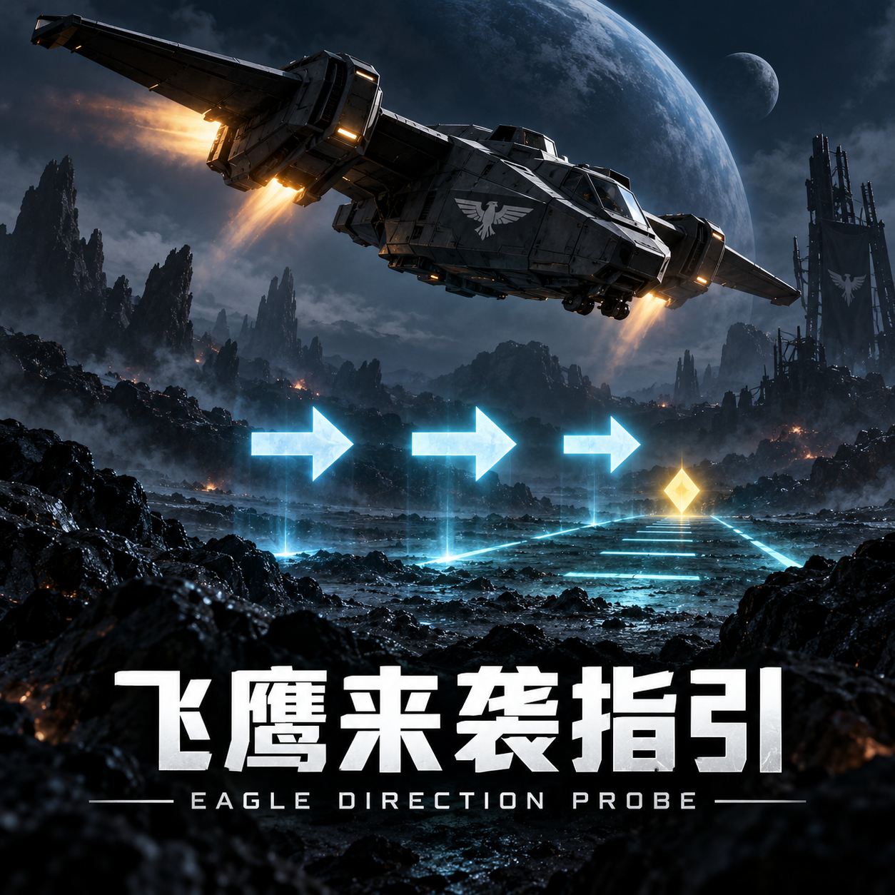
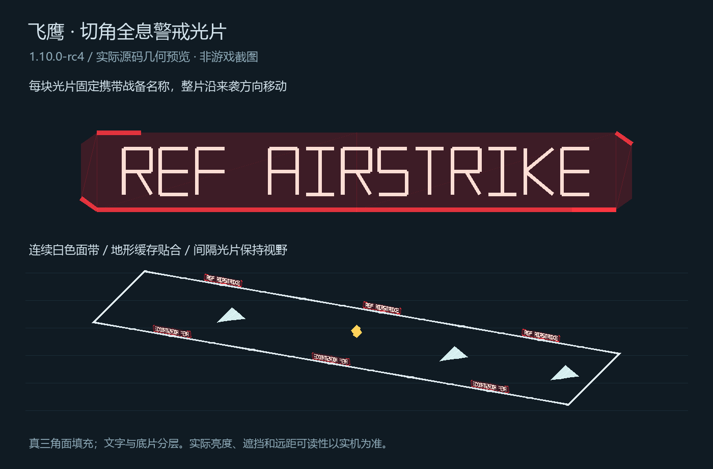

# 飞鹰来袭方向探针 / Eagle Direction Probe



[下载 v1.10.0-rc15 预发布说明](https://github.com/Puipipi/HD2-EagleDirectionProbe/releases/tag/v1.10.0-rc15)

## 当前测试版：1.10.0-rc15 地形贴合与透视轮廓（2026-10-10）

rc15 是已发布的手动导入预发布候选：[下载 ZIP](https://github.com/Puipipi/HD2-EagleDirectionProbe/releases/download/v1.10.0-rc15/HD2-EagleDirectionProbe-1.10.0-rc15.zip)。导入后请完全退出并重启游戏；不会自动部署。原生投光对照为可选功能，需要已启用的 Helmet Headlamp 资源，该资源不随包分发。主线段请求深度测试；填充沿用原有 world GUI 绘制。透视关闭时不提交额外透视轮廓；开启时保留 GUI 填充，并额外提交无深度测试的虚线外轮廓，不向该轮廓通道提交填充面、扫描填充线或字形碎边。Stingray GUI 的深度排序/剔除行为仍需游戏内像素确认，因此这不是已实证的遮挡保证。

地面边带沿用已采样 terrain grid 的轴向站点放置顶点，使窄峰等已采样高度能落在边带网格上；不增加地形查询，仍最多每帧两次、沿用 0.5 ms 软预算。新增的指引工作帧统计只计有几何或自有投光对象的完整 Lua 工作与 draw 耗时，不代表像素可见性、GPU 时间或游戏 FPS。配对离线基准取三次运行均值的中位数：透视关闭时，1/4/8-guide 的 rc14 中位耗时为 0.0642/0.2457/0.4708 ms，rc15 为 0.0846/0.2969/0.5065 ms，回退约 8–32%。透视开启时 rc15 中位耗时为 0.2631/0.8352/1.7510 ms；绘制后端与旧版不同，不作比例比较。330 项离线测试通过；离线数据不代表实机 FPS，0.05 ms/帧目标尚未达到。候选 ZIP 为 2,237,125 字节，SHA-256：`984fea68052189d08b46c24338be42410aac1dcdc153754cea60e6391a4cdf58`。

紫光投光生命周期和原始白光对照沿用 rc14，实际地面照明仍待用户实测；红光不可见原因未定位。头顶 DANGER/PATH? 提醒已移除，飞鹰/天空方向箭头、地面走廊、落点菱形和六块文字光片保留。已知类型横向范围仍是用户选择的显示参考，不是伤害边界；不依赖 HD2Runtime、不限制 guide 数量。

rc12–rc14 以下内容仅为本地历史验证记录，未单独发布；旧候选包不随 rc15 上传。

## 上个测试版：1.10.0-rc14 紫光对照与简化提醒（2026-10-10）

rc14 是本地候选包。手动导入 `dist/HD2-EagleDirectionProbe-1.10.0-rc14.zip` 后完全退出并重启游戏；到主菜单即可读取一次性 native-light 能力行。游戏日志位于 `%LOCALAPPDATA%/CowboyBingus/Helldivers2/Logs/EagleDirectionProbe.log`；复现多条走廊时反馈 `beacon B#` 事件。

紫色原生灯对照只把自有灯颜色设为 `(1,0,1)`，强度保持 7000；位置、旋转和资源光锥不变。可选的 **资源原始白光对照** 跳过颜色、强度 setter，重新创建自有 helper 并读回该模式的原始值。原生目标灯在每个绘制帧重新启用，关闭或指引退场时清理。增加了变换刷新后的首次读回与错误报告，但红光未出现的根因仍未定位，紫色或原始白光是否可见也需要手动实机确认。光片文字每块只绘制面向本机观察者的一面，保留六块完整标签；游戏材质的剔除和实际可读性仍待确认。

已移除头顶的 DANGER/PATH? 潜兵提醒及其轮询。天空方向箭头、飞鹰箭头和地面走廊保留；本机 pose 仅用于光片文字的观察侧选择。多资源蓝色支援信标不会获得飞鹰走廊。横向战备显示参考为总长约 **66.67 m**、总宽 **20 m**；这是用户选择的范围校准，不是伤害或安全边界。140mm 仍只提示潜在路径。没有新增地形查询或 Runtime 依赖，也没有 guide 数量上限。

离线对照仍未达到 **0.05 ms/帧**：1/4/8 guide solid 中位数约为 **0.0908/0.2853/0.4375 ms**，line fallback 约为 **0.0600/0.2031/0.4058 ms**。测试使用合成 guide 和模拟 native 边界，不覆盖真实玩家姿态、引擎提交或 GPU 灯光成本，也不代表游戏 FPS。QPC 统计与 active/idle 分桶的定义见 [rc13 说明](docs/release-1.10.0-rc13.md)。

**298 项离线测试通过；11 个 Lua 资源通过 LuaJIT 编译与封装校验。** 本机已安装 rc13 的实测日志表明紫光参数和 helper 位置读回成功，但紫光仍不可见。该读回不能证明投光已照到地面。rc14 ZIP 为 **2,230,967 bytes**，SHA-256 为 `41618773c909c048a44ad74d3dda3b803af0a09f4d64ebbbe6405ee236e51980`；[rc14 说明](docs/release-1.10.0-rc14.md)记录了封装和离线限制。

## 上个测试版：1.10.0-rc10 原生投光兼容修复与凝固汽油参考校准（2026-10-09）

[下载 rc10 测试包](https://github.com/Puipipi/HD2-EagleDirectionProbe/releases/tag/v1.10.0-rc10)，
或手动导入 `dist/HD2-EagleDirectionProbe-1.10.0-rc10.zip`。沿用 GUID，不自动部署。

rc9 实机日志记录 `Light.set_spot_angle_start unavailable`，原型在创建灯前即停止；rc10 保留资源自带光锥和衰减，按已知名称解析四个功能灯，并把 `Unit.num_lights`、`Unit.has_light`、`World.update_unit` 作为可选能力处理。
任务填充灯仍设为红色，其余已解析的功能灯与可选标记灯关闭；清理仅使用本原型持有的灯光句柄。

原生投光开关仍默认关闭，需另外安装并启用 Helmet Headlamp 1.0.0 资源。rc10 修复的是实机 API 兼容门槛，红光是否能照亮地面、光轴是否朝下、亮度和 GPU 成本仍待实机验证；没有刺魟投影纹理，也不声称已经解析其投影资源。

凝固汽油参考长度按用户校准：旧 100 m 范围的两端各缩短 1/6，形成总长约 66.67 m、总宽 20 m 的参考范围；中心和来袭方向保持不变。这是显示校准，不是已测量的伤害、弹着或持续火场边界。

216 项全量离线测试通过；七项资源通过 LuaJIT 编译与封装校验，原生地形与 1.9.10 的字节比较记录在 [rc10 交付说明](docs/release-1.10.0-rc10.md)。没有新增地形查询或活跃灯数量上限；普通方向指引不依赖 HD2Runtime。

## 上个测试版：1.10.0-rc9 原生红光原型与六块循环光片（2026-10-09）

[下载 rc9 测试包](https://github.com/Puipipi/HD2-EagleDirectionProbe/releases/tag/v1.10.0-rc9)，
或手动导入 `dist/HD2-EagleDirectionProbe-1.10.0-rc9.zip`。沿用 GUID，不自动部署。

**实机更正：** rc9 日志于 2026-10-09 11:18:47Z 记录 `Light.set_spot_angle_start unavailable`；该能力预检导致 helper 未创建。请用 rc10 重新验证原生投光。

光片改为**左右各三块、等间距首尾循环**，整块光片和两面的战备名称同步以 10 m/s 移动。
到末端后整块回到开头，保持完整尺寸、文字和不透明外观。矩形、窄走廊及圆形参考范围均覆盖测试。
光片几何单独以 **10 Hz** 缓存，箭头仍为 **20 Hz**，移动速度均保持 10 m/s。
天空箭头跟随同一战备范围的首尾变化：短范围减少到 2～4 支，较长范围最多 5 支，保持完整竖直箭头形状。

MOM → 飞鹰方向指引 → **原生红色投光验证（需头灯资源）**，默认关闭，开启后应用保存。
本次按用户授权临时使用另外安装的 **Helmet Headlamp 1.0.0** 光源资源：
在模组管理器启用该模组的资源选项（`Default Mode - Gameplay` 或 `Default Mode - Task Light`）。
本包不附带它的资源或控制器代码；普通方向指引无需头灯模组，也无需 HD2Runtime。

每个有效落点上方 12 m 创建独立的向下红色聚光灯，验证地面、岩石被真实照亮的观感。
当前只验证落点附近的原生照明，尚不覆盖完整矩形攻击范围，也没有刺魟的投影纹理。
不操作已有头灯实例或设置。资源/API 缺失时省略投光，其他指引继续显示；日志记录不可用原因。
开启原生测试时隐藏 rc8 的整块红色半透明覆盖，关闭后恢复原覆盖开关的保存值。

每帧最多创建一个灯光实例，没有活跃数量上限；静止灯光不重复更新位置或颜色，且不增加地形查询。
灯光随指引结束、关闭开关、绘制失败或退出而清理；场景已销毁时不对旧 world 调用销毁。
实际亮度、方向和 GPU 开销需实机验证，正式独立资源仍待原型结果确认。

209 项离线测试通过；七资源编译/封装校验通过，原生地形两资源保持 1.9.10 字节一致。
1 路空袭的离线平均为 **0.0503 ms/帧**，4 路为 0.1663、8 路为 0.3303；多人压力场景尚未达到总计 0.05 ms/帧。
六块光片的面片数量高于 rc8；独立缓存减少了持续更新量，详见
[1/4/8 路对照数据](docs/benchmark-1.10.0-rc9.json)。此基准不启用原生灯且使用模拟绘制器，不能表示游戏 FPS 或灯光 GPU 成本。
保留 MOM 高度滑条、方向锁定及既有退场逻辑；稳定版仍为 1.9.10。

## 上个测试版：1.10.0-rc8 贴地红色范围光幕（2026-10-09）

[下载 rc8 测试包](https://github.com/Puipipi/HD2-EagleDirectionProbe/releases/tag/v1.10.0-rc8)，
或手动导入 `dist/HD2-EagleDirectionProbe-1.10.0-rc8.zip`。沿用 GUID，不自动部署。

MOM → 飞鹰方向指引 → **地面红色范围光幕（测试）**，默认关闭，开启后点击“应用”保存。
需同时开启“按战备调整参考范围”和“真正面填充”，关闭“透视显示”。
在已识别的参考范围内铺设淡红色真实三角面；500kg 为圆形，其余沿现有参考范围。
这是半透明地面覆盖，不会像投影灯一样照亮岩石或角色。REF 仍是估算范围，不是精确伤害边界。
未知战备、110mm、关闭范围适配时保留原方向指引，不铺红色面积。

光幕只读取已有碰撞地形缓存；未采样、未命中或原生查询不可用的地面留空。
沿用每帧最多 2 次查询及 0.5 ms 软预算，没有额外采样和数量上限。
光幕保留为静态面片，不随动效逐帧更新，随现有指引一起退场。
“地面指引离地高度”滑条同时控制光幕，它比箭头低 2 厘米、最低 0 厘米。
仅开启光幕时可独立显示，不强制附带落点菱形；线段回退或透视模式不绘制光幕。

197 项离线测试通过；六资源编译/封装校验通过，原生地形两资源保持 1.9.10 字节一致。
开启会增加常驻面片和透明混合的绘制开销；[离线开关对照数据](docs/benchmark-1.10.0-rc8-area.json)
只测 Lua 与模拟原生调用，不能证明实机 FPS 或 GPU 开销。实际亮度、遮挡及性能需手动验收。

## 上个测试版：1.10.0-rc7 MOM 地面离地高度滑条（2026-10-09）

[下载 rc7 测试包](https://github.com/Puipipi/HD2-EagleDirectionProbe/releases/tag/v1.10.0-rc7)，
或手动导入 `dist/HD2-EagleDirectionProbe-1.10.0-rc7.zip`。沿用 GUID，不自动部署。

MOM → 飞鹰方向指引 → **地面指引离地高度（厘米）**：
范围 **0～100 厘米**，每格 **1 厘米**，默认 **8 厘米**。
点击“应用”后更新当前走廊边框和地面三角，并由 MOM 保存，下次加载恢复。
光片、落点菱形、天空箭头保留各自高度；0 厘米可能与地表共面闪烁。
调整高度只重建显示几何，复用现有地形缓存，不增加查询，也不重置活跃指引。

189 项离线测试和六资源编译/封装校验通过。保留 rc6 的性能优化、不透明双面光片、
方向锁定及退场；无 Runtime 依赖。滑条实机交互仍需手动验收，稳定版仍为 1.9.10。

## 上个测试版：1.10.0-rc6 绘制优化与贴地修正（2026-10-09）

[下载 rc6 测试包](https://github.com/Puipipi/HD2-EagleDirectionProbe/releases/tag/v1.10.0-rc6)，
或手动导入 `dist/HD2-EagleDirectionProbe-1.10.0-rc6.zip`。沿用 GUID，不自动部署。

真填充的正反两面共用当前帧的三个原生顶点，减少一半顶点构造；
未变化的纯面片画面跳过颜色构造和重复扫描。所有缓存仅保存普通 Lua 几何，
原生向量/颜色仍在当前帧创建。线段回退保留逐帧提交，不复制额外线段列表。

1、4、8 路真填充离线基准的 Lua 耗时约降低 **20%～25%**，顶点构造约减少 54%、颜色构造约减少 71%；
基准使用模拟原生渲染器，**不代表游戏 FPS 提升幅度**。光片之间留更大空隙，抵消双面标签的绘制量。
地面边框/三角的固定离地抬升从 0.8 m 降至 0.08 m，减少平地悬浮遮挡；
光片改成不透明深红底板、亮红边缘与浅色文字，内外两面均可读；每条长边改为 1～2 块流动光片，
保留原来的竖立高度，并复用字形同列的地形高度计算。
20 Hz 动效、移动速度、显示数量、地形采样精度与查询预算均保留。
186 项离线测试通过；保留 rc5 首次范围显示修复。稳定版仍为 1.9.10。
详见 [性能测量与实机对照步骤](docs/performance-1.10.0-rc6.md)。

## 上个测试版：1.10.0-rc5 首次显示前确认战备范围（2026-10-09）

[下载 rc5 测试包](https://github.com/Puipipi/HD2-EagleDirectionProbe/releases/tag/v1.10.0-rc5)，
或手动导入 `dist/HD2-EagleDirectionProbe-1.10.0-rc5.zip`。

修复正常召唤时先闪现默认走廊、随后才变成具体战备范围的显示顺序：
类型识别提前到原有落地稳定阶段，仍使用 5 Hz 双次唯一匹配。
若首次确认尚未完成，范围边框、地面三角和光片最多等待 0.45 秒；
落点、飞机与天空箭头继续显示。读取失败立即回退，空结果/歧义有界回退，
极晚才出现的记录仍可能后续适应。关闭自适应范围不等待。

179 项离线测试通过；保留 rc4 外观、配置、性能优化及原生地形资源。
无自动部署。详情见 [首次显示修复](docs/initial-type-display-1.10.0-rc5.md)。

## 上个测试版：1.10.0-rc4 真面边带与固定带字全息光片（2026-10-09）

[下载 rc4 测试包](https://github.com/Puipipi/HD2-EagleDirectionProbe/releases/tag/v1.10.0-rc4)，
或手动导入 `dist/HD2-EagleDirectionProbe-1.10.0-rc4.zip`。沿用 GUID，没有自动部署。

- 真填充开启时，白色边框现在是 **0.5 m 连续三角面带**；500kg 参考圆使用面环。
- 参考赛博朋克封锁牌，重做切角红色薄光片、低透明度底片及细亮边。
  每块光片全程带名称，去掉原来“无字长矮片 / 带字短高片”互相切换的路径。
- 文字也用真实面片，向外错开 4 cm，减少与底片共面争抢；尺寸不随摄像机距离改变。
  光片和文字仍以 10 m/s 同步流动，复用地形缓存与 20 Hz 动效。
- 减少每条边的光片数量，缓存模板、合并共线字笔画、复用顶点及静态面片。
  172 项离线检查通过；增加真面文字仍会增加绘制量，实机帧率与远距可读性待验收。

此前关闭“真正面填充（测试）”的保存值会保留；需要在 MOM 打开才能看到面带与实心文字。
透视模式仍使用线段回退；警戒带可单独关闭。无 Runtime 依赖、无活跃指引数量上限，
地形共享每帧两次查询的预算不变。稳定版仍为 1.9.10。



详情与实机步骤见 [rc4 说明](docs/hologram-fix-1.10.0-rc4.md)。

## 上个测试版：1.10.0-rc3 填充坐标与离场摆动修复（2026-10-09）

[下载 rc3 测试包](https://github.com/Puipipi/HD2-EagleDirectionProbe/releases/tag/v1.10.0-rc3)，
或手动导入 `dist/HD2-EagleDirectionProbe-1.10.0-rc3.zip`。不自动部署。

修复 rc1/rc2 真填充将距离和高度交换的问题。完整原生路径中，创建时已有两次轴转换，
更新时只有一次；现在创建传 XYZ、更新传 XZY。旧模拟测试只检查包装层，漏掉最终顶点转换，已纠正并增加实际显示顶点比对。
**rc1/rc2 不建议继续使用**；临时关闭 MOM“真正面填充（测试）”可恢复原线段。

任务轨迹还复现了飞鹰机头仍向下时便开始离场偏航的情况。地面/天空方向现于低空进入攻击区时单向锁定，
保持到该指引结束；远处进场及飞机旁箭头继续实时更新。锁定区域是启发式，不能保证预测所有障碍规避。
地形预算、动效、菜单保存及原退场清理保留。167 项离线测试及六资源编译通过；
**用户已确认面片显示位置正确；离场锁定及其他实机情形继续验收**。详情见 [rc3 故障说明](docs/display-fix-1.10.0-rc3.md)。

已保存的真填充关闭值会保留。导入 rc3 后需在 MOM 主动打开，才能复验新面片坐标。
稳定版仍为 1.9.10，rc2 的类型/范围候选功能也包含在 rc3 中。

## rc2 功能说明：战备名称与参考范围

[下载 rc2 测试包](https://github.com/Puipipi/HD2-EagleDirectionProbe/releases/tag/v1.10.0-rc2)，
或手动导入 `dist/HD2-EagleDirectionProbe-1.10.0-rc2.zip`。不自动部署游戏。

参考用户提供的模组，独立实现每秒 5 次的有界只读战备快照。连续两次确认球与记录互相唯一，
才显示八类飞鹰的具体名称；重叠、未知或读取失败且尚未识别时保留 `EAGLE ?`。
已确认的名称随本次指引保留，任务/世界切换清除。实际飞机决定方向与离场，类型记录不改这条逻辑。

空袭、集束、汽油、烟雾与毒气按类型显示参考条带，扫射为前向窄带，500kg 为 25 m 参考圆。
**REF 是基线估算，不是实测伤害或安全边界**，未读取舰船升级或预测实际散布。
110mm 目标未知，保留方向走廊，不猜目标圆。
MOM 新增默认开启并独立保存的 **“具体飞鹰名称（测试）”**、**“按战备调整参考范围（测试）”**；
两项同时关闭即停止类型读取。没有 Runtime 依赖，没有活跃指引数量上限；地形仍共享每帧最多两次查询。

沿用 rc1 真正世界三角面填充：飞鹰箭头、天空 →、地面三角、菱形及移动光片均使用面片；
白色边框和文字保留线段。MOM **“真正面填充（测试）”** 默认开启，关闭恢复密排线段。
开启透视或缺失接口时使用线段回退。

165 项离线检查及六个资源的 LuaJIT 编译门禁通过。**类型关联、世界 GUI 材质、遮挡及性能仍需实机验证**；
稳定版仍为 1.9.10。详见 [rc2 说明与实机步骤](docs/type-range-candidate-1.10.0-rc2.md)、
[rc1 接口核查历史及 rc3 更正](docs/solid-fill-candidate-1.10.0-rc1.md)。

## 上个稳定版：1.9.10 光片与标签顺向流动

安装包：`dist/HD2-EagleDirectionProbe-1.9.10.zip`，沿用原 GUID，供手动导入，没有自动部署。
已加入飞鹰与全息箭头主题封面：`assets/cover.png`；包内根目录 `cover.png` 通过管理器
`IconPath` 和选项 `Image` 引用，不部署进游戏数据。生成说明与原始提示词见 `docs/cover-prompt.md`。
依赖 Bingus Shared Loader v15+ / API 1；**不依赖 HD2Runtime，也无需运行期安装 BTO**。

- 地形采用整条走廊的粗碰撞采样：约 10 m 步长、左中右三列、63 点。
  所有走廊共享每帧最多 2 次查询、0.5 ms 软预算。缓存高度，明显转向才刷新。
  小石块和尖锐起伏仍可能穿线；软预算不能中断一次原生调用，实际耗时待实机验证。
- 独立查询模块检查游戏构建、代码指纹、单位/世界、查询预设和包装函数地址。
  不匹配时不调用，暂停重试并回退信标插值，日志给出原因。1.9.3 地形效果获用户实机确认；
  本次显示和菜单改动尚待实机验收。屋顶/物体也可能被射线击中，缓存不会自动反映地形破坏。
- 每个实际投出的战备球独立拥有走廊，修复旧球吞新球、双球落地漏显示的已复现路径。
  金色竖向落点始终在实际球位置。飞机与信标对应仍使用启发式；实机偶发错位需继续对照。
  本次修复短暂停稳后重新飞行、已退场对象再次投掷，以及未绑定飞机时查询漏失导致
  永久禁用走廊的三条回放路径。真正确认飞机退场仍同步隐藏；恢复不延长原未绑定期限。
- 空中主干后伸 220 m、前伸 120 m；地面走廊长 200 m。持续拉升离场确认后同步隐藏，
  查询漏失缓冲 0.75 秒。活跃飞机和走廊没有数量淘汰。
  抵达攻击区域后，浅角度抬升及低点上方的水平偏转不再更新走廊/天空来袭方向；
  飞机旁箭头仍跟随机头。短暂抬头后回到低点平飞或重新俯冲可恢复方向更新。
- 天空五枚箭头改为单层**竖直平面上的 →**，带长方形箭杆和上下展开的尖头，没有边界。
  每枚长 14 m、高 6.4 m，中心在当地地形上方约 12 m；整枚按脚下缓存地形抬高，
  未取得高度时用落点高度兜底。箭杆沿来袭方向，竖直平面从侧面可见，正端面观察会变窄。
- 地面保持长 200 m、宽 12 m。地面和天空所有方向头均以 10 m/s 顺向流动，
  间距 28 m；静止前端头移除。动效独立缓存约 20 Hz，不增加碰撞查询或重建整条静态走廊。
- 白色边框由三条连续线组成，覆盖约 0.5 m 宽；仅两条长边上方加入断续红色竖直光片，
  每侧六至七块随循环进出显示区，间隔 30 m，底部距缓存地面约 1.1 m。淡红内部、亮红底边及短上角标，
  落点附近双侧显示世界文字，没有交叉斜纹。短边没有竖直红带。
  地面三角放大约 30%，当前长 5.2 m、宽 5.8 m。光片与附着文字也按 10 m/s 前进，
  到走廊末端循环；标签保留在最靠近战备球的光片上。白色边框与菱形稳定，
  动效复用约 20 Hz 缓存和已有地形高度，不增加地形查询。仅开边框时也能流动。
- 箭头改为密排线条填充轮廓（含机头和主干上的方向头），金色落点为约 2.8 m 的填充菱形，
  比 1.9.6 的 2.2 m 放大约 27%，保持原实心形状和位置。
  仍仅使用已验证的 LineObject 绘图；不是三角面实体，极近距离可能看出扫描线。
  密排实心外观保留，每帧仍需向引擎提交线段；实机绘制开销需任务内验证。
- 地面静态图形与飞机图形分别缓存，飞机移动不再重算已完成的地面边框/落点。
  高度插值取消临时表，动画复用地面签名。离线单/四/八架脚本基准较 1.9.7
  CPU 时间下降约 39–48%，分配量下降约 60–62%；原生渲染为模拟，不能换算成实机 FPS。
  上述为 1.9.8 的优化结果。1.9.9 新图形使默认线段提交约增加 44%、分配量增加约 11–12%；
  全局查询预算与地形精度不变，缓存完成后的基准没有地面重建或新增查询。不能声称本版更快。
  1.9.10 光片改为运动后，离线每帧线段略少于 1.9.9，Lua 分配及计算增加；
  单/四/八指引脚本约 0.051 / 0.180 / 0.459 ms/帧，原生渲染为模拟，实机成本待验证。
- **透视默认关闭**。可选 Mod Options Menu：`MODS → 飞鹰方向指引`，有“透视显示”
  及四个默认开启的独立开关：“飞鹰指示箭头”“天空方向箭头”“地面走廊边框”
  “地面走廊三角”，以及默认开启的“红色全息警戒带”。红带与文字跟随边框开关，
  也可单独关闭；任一地面开关开启时显示金色落点；关闭飞鹰指示箭头也隐藏尾迹。
  应用后立即生效，选择由 MOM 保存；参考战备冷却模组，先读保存值再同步有效值，
  不在定时器里重复写设置。没装菜单也能按默认值运行；天空与地面都关闭时停止地形查询。
  旧 `EagleCorridor.occluded` 文件仍兼容，菜单保存值优先。
- 四个同时落地的队友信标、无信标的四架已识别飞机均通过离线回放。
  飞鹰风暴仍未实机验证；若不生成普通战备球，当前没有可靠的地面落点来源。
  已识别飞机资源可独立画空中箭头，但不能据此声称完整支持该效果。

**以下为 1.9.10 稳定版状态，rc2 测试版变化见上文。** 具体战备类型未识别，警戒带文字为 `EAGLE ?`；
条带也不是已测伤害范围，未实现自动范围适配。[Wiki 与根 CT 研究](docs/eagle-stratagem-profiles-2026-10-09.md)
已整理八类战备及单弹半径；CT 手选槽位不能关联本次投掷。离线档案不参与运行。
旧版空颜色提交、LuaJIT JSON 转义及错误编译门禁均已修复，不能据此声称排除所有原生崩溃。
原生故障不能由 pcall 捕获。此版本需任务内验收。

验证：136 项检查通过，包含真实 LuaJIT 下 140 fps、单/双飞机、查询缺帧、颜色参数、
远端山脊、缓存、全局查询预算、七走廊公平性、原生前置检查和多球归属。
本次还覆盖菜单迟加载、已保存值、实时切换深度、部分注册失败重试，以及天空位置/地形与
动画缓存，以及最近一局位置轨迹回放、查询恢复期限、填充密度和竖直箭杆/头部随方向旋转。
本次还覆盖浅角度抬升/离场水平偏转、短暂抬头恢复、四开关独立显示、仅天空/仅边框、
保存的 false 值与菜单重新加载、飞机移动复用地面缓存，以及加粗连续白线、远端红带、
双侧缓存文字、新开关与 10 m/s 同步动效，以及光片/文字位置移动、完整循环和仅边框模式。
详见 `docs/mission-feedback-1.9.10.md`。
`docs/holographic-geometry.png` 和
`docs/holographic-motion.gif` 为源码几何示意，非实机画面。
`docs/cordon-panels-preview.png` 展示断续光片及标签近景。1.9.10 的所有填充仍为密排线段；
真正三角面接口的核查结论见 `docs/mission-feedback-1.9.9.md`。

```powershell
python -B -m unittest discover -s tests -q
python -B tests/offline/run_harness.py
python -B work/standalone/build_probe.py --validate-only
python -B work/standalone/build_probe.py
```

运行日志：`%LOCALAPPDATA%\CowboyBingus\Helldivers2\Logs\EagleDirectionProbe.log`；
样本：同目录 `EagleDirectionProbe-<时间戳>.jsonl`。`terrain queries` 及关机汇总记录查询量、
命中量、每帧上限和峰值耗时。`EagleCorridor.off` 禁用绘图；正常测试不要创建自检文件。

**下文是历史实验记录，版本与安装步骤已过时。不要安装其中的 0.2.0 / 0.3.0 包，
也不要把历史段落里的“已修复”“不绘制”“全部经过实机验证”当作当前状态。**

---

**状态：已从「只读测量工具」变成**测量 + 走廊绘制**（`0.7.0`）。
测量部分已在实机跑过：两条飞鹰来袭规则各 5/5 被确认。绘制部分**代码路径已在实机验证**（自检在飞船上
画出并释放了一条线），但**任务里的实际观感尚未验证**——那需要真的进一局。
`0.2.0` 与 `0.3.0` 两次导致游戏终止；两者的载荷都已从工作区和模组管理器里替换掉，不要使用。**

## 事故记录：两次终止，两个不同的根因（2026-10-07）

两次都是我的错，而且两次的原因**不一样**——这一点值得写清楚，因为第一轮修复只治了其中一个。

### 第一次：`0.2.0` → `0xC0000409 STATUS_STACK_BUFFER_OVERRUN`（`__fastfail`）

| | |
| --- | --- |
| 现场 | 转储 `helldivers2.exe.32240.dmp`；加载器日志确认本 addon 已加载 |
| 触发场景 | **在装配界面选择飞鹰战备时**（不在任务里、不在呼叫中） |
| 真实机制 | 飞船上有一个**完全静止**的同资源物件（268 个样本里只移动了 **1.5 mm**），探针仅凭「存在信标资源」就把它当成一次呼叫，于是**在菜单里连续 29 秒每帧采样** |
| 致命缺陷 | 全程**没有 `sr.Script.temp_byte_count` 存取**。工作区已跑通的覆盖模组把「存/取 temp 字节数」当**每帧纪律**（顶层 `protected()` 包住整个 tick，逐单位读包围盒时也成对调用）。脚本临时内存区不自动重置，只分配不还原就会累积，最终溢出 → fail-fast |
| **不是**的原因 | **不是查询太慢。** 0.6.0 逐键实测：`units_by_resource` 每次 **0.00 ms**，整帧开销低于 `os.clock()` 的 15.6 ms 分辨率。我一开始怀疑「每帧 11 次查询太贵」，实测推翻了它 |

### 第二次：`0.3.0` → 同样的 `0xC0000409`，但死在**启动时**

| | |
| --- | --- |
| 现场 | 加载器日志**最后一行**是 `mods/codex/eagle_direction_probe: loading`，**没有对应的 `: loaded`**，该次会话也没有 `Startup finished` |
| 根因 | 我**凭空猜了一个 API 签名**：写了 `pcall(gs.in_session)`。工作区里**每一个**已跑通模组写的都是 `in_session(session)`，且先用 `sr.Network.game_session()` 拿到 session 并判空。缺参数进原生绑定 → 原生层空引用 → fail-fast |
| 教训 | `pcall` **挡不住原生崩溃**，它只挡 Lua 错误。猜签名在这里是致命操作 |

## `0.6.0` 的修复（每条都有测试兜着）

| 缺陷 | 修复 |
| --- | --- |
| 菜单误采（把静止物件当呼叫） | **移动判据**：信标单位必须移动超过 `BEACON_MOVE_M`（0.75 m）才算一次投掷；表以**单位句柄**为键（身份串是资源哈希，被所有信标共用，以它为键会让一次真实投掷永久污染后续）。静止物件会被点名忽略 |
| 没有 temp 纪律 | 每帧都在 `temp_guard_begin`/`temp_guard_end` 守卫内，并**计时**，`temp_bytes` 写进状态行 |
| 每帧查询风暴 | 每帧只查 **2 个**身份（飞机 + 信标）；弹种识别改为**每次呼叫一次**、带 20 ms 预算、**逐键记录耗时** |
| 猜 API 签名 | `in_session(session)`，session 取自 `Network.game_session()`，写法照抄已跑通模组 |
| 启动期触碰引擎 | `STARTUP_GRACE_S`（20 s）内一次引擎调用都不发 |
| 无法区分「空闲」与「读不到」 | **每 30 s 一条状态行**，任何界面都写：`worlds / session / beacon_units / aircraft_units / temp_bytes / last_tick / samples / calls / backoff` |
| 探针可能拖累游戏 | 25 ms 帧预算 + 退避 + 连续 5 次超标**永久自停** |
| 崩溃丢数据 | jsonl 定期 flush（0.1.0 的数据就是随崩溃丢的） |

### 实机验证结果（`0.6.0`）

```
v0.6.0 installed ... Script=table Window=table
status: worlds=11 session=true (GameSession.in_session(session)) beacon_units=1
        aircraft_units=0 temp_bytes=0 last_tick=0.0ms samples=0 calls=0 backoff=x1
a beacon-identity unit is present but has not moved 0.75 m: ignoring it as the ship prop
```

加载器：`Startup finished: 61 loaded, 0 failed`；游戏进入飞船界面并稳定运行；**`calls=0`** 证明静止物件
不再被误判；**无慢帧、无自停、无错误、无新转储**。

### 第一次实机测量：三个发现（其中一个是数据丢失）

玩家在 10:36–10:43 那次会话里丢出 **5 次飞鹰**（机枪 3 次、集束 2 次），并标注了哪几次被大型掩体偏转。
从这次会话学到的东西，按严重程度排：

| 发现 | 事实 | 后果 |
| --- | --- | --- |
| **数据丢失（最严重）** | 探针用 `'w'` 打开**固定文件名**的 jsonl。玩家重开游戏 → 文件被截断成 0 字节。会话结束时它已有 103,761 字节 | **那一局的位置数据全部不可恢复。** 日志是追加模式所以活着，但里面只有计数与呼叫边界，**没有坐标**，几何量无法重建 |
| **呼叫合并** | `CALL_TIMEOUT_S` 是 30 秒，**比玩家两次投掷的间隔还长**；一次呼叫存活期间不会开始新呼叫 | **5 次投掷只产生 3 次呼叫**，有两次被吞进前一次呼叫里 |
| **弹药身份无法枚举** | 11 个弹药键（`eagle_cluster` 等）**每次返回 0 个单位、0.00 ms**；而飞机路径查询在同一时刻返回 `aircraft_units=1` | 呼叫无法从日志自我标识（`saw=nothing`）。**弹药不是可枚举的「单位」**——它们是投掷物，至少不是 `units_by_resource` 的键。按型号的分析只能靠玩家交代投掷顺序 |

同一次会话的**好消息**：飞机路径 `content/fac_helldivers/vehicles/eagle/eagle` **查得到**（呼叫期间
`aircraft_units=1`），所以几何测量本来就成立；而且 `slowest_tick=5.0ms`、`slow_ticks=0`、`errors=0`，
证明这套开销与自停设计在真实任务里站得住。

`0.6.1` 针对前两条的修复：**每会话一个文件名**（`EagleDirectionProbe-<时间戳>.jsonl`，不再截断历史，
并顺便避免跨会话的呼叫号冲突），启动时在日志里写出该文件名；`CALL_TIMEOUT_S` **30 → 10 秒**，
让每次投掷成为独立呼叫。第三条**未修**——它需要另找弹药的身份来源，目前用分析器的
`--stratagems "1=strafing_run,2=..."` 覆盖来标注型号。

### 第二次实机测量：两条规则被确认 ✅

玩家投出 **机枪 5 次 + 集束 5 次，全部为无障碍的标准入场**（刻意排除规避偏转的干扰）。
`0.6.2` 的速度判据与 `primary` 标记生效后，分析器给出：

```
VERDICT over 10 measurable call(s), grouped by stratagem:
  strafing_run   along_from_behind   mean|err| 4.4°   signed -5.2, 3.3, 3.9, 4.5, 5.2   fits
                 expected along_from_behind -> confirms
  cluster        perp_right          mean|err| 5.6°   signed -5.2, -4.7, 4.4, 6.4, 7.3   fits
                 expected perp_left/perp_right -> confirms

  Pre-registered families: 2 confirmed, 0 contradicted, 0 unregistered
```

**两条先验规则各自 5/5 吻合，无一被反驳。** 具体结论（方位角均用
`bearing(dx,dy) = atan2(dy,dx)`，取引擎原始 x、y）：

| 型号 | 来袭航向（相对「潜兵→信标落点」连线方位 B） | 残差 |
| --- | --- | --- |
| 机枪扫射 | **B**（沿连线，从潜兵身后往信标方向飞） | −5.2 … +5.2° |
| 集束炸弹 | **B − 90°**（垂直，恒定一侧） | −5.2 … +7.3° |

三点值得单独指出：

1. **侧面是恒定的，不是随机的。** 5 次集束的连线方位跨越 −131° 到 +149°，而航向始终落在 B−90° 上
   （±7°）。所以「从左侧来」是**相对连线**定义的，不是相对世界坐标。玩家口中的「左侧」对应本表的
   B−90°；`perp_right` 只是我的命名，**它与玩家视角的左右可能相反**，因为引擎轴向的手性我没有独立确定。
2. **残差 ±5–7° 是小而系统的**，不是噪声：最可能的来源是「投掷起点」取的是信标第一个采样点，而它离
   潜兵的手有几个米。对做模组而言这个量级不需要修，但要记账。
3. **这是「名义规则」的确认，不是「永远正确」。** 上一局已经实测到规避偏转，而且集束被掩体改变时
   **方向整个反过来**（左→右 变成 右→左）。所以按名义轴画的预测箭头在掩体附近会错，可能错到指反。

同一次会话的其他验证：11 次呼叫里 10 次可测（第 11 次没有飞机轨迹）；飞机航迹长度约 1500–1900 m、
可见 6.6–8.9 s（约 200 m/s，符合喷气机）；探针记录的飞机朝向向量与规则拟合用的航向一致，
无慢帧、无自停、无错误。

## `0.7.0`：飞鹰走廊（方案 B —— 只画轴线，绝不误导）

**目的不是预测，是「它现在实际在哪条线上」。** 玩家本来就知道各型号的名义来袭方向；真正会弄死人的是城市图里飞鹰因规避而乱飞的那一次通行。所以画的是**实际轨迹**，不是公式算出的预测：

- 飞机的**实际地面轨迹**（已飞过的部分，逐采样点连线）；
- 沿**当前朝向**向前延长 `FORWARD_M = 900 m`；
- 末端一个**箭头**，指明来袭方向。

**为什么只有轴线、没有宽度**：宽度按型号不同，而实测已经确认**我们分不出这一次是哪个型号**（11 个弹药身份键全部返回 0 个单位）。宽度就是猜；而 500kg 是**点打击不是条带**，给它画条带会主动误导。轴线对**每一个**型号都成立，所以先出轴线。

| 决定 | 选择 | 理由 |
| --- | --- | --- |
| 形状 | 轴线 + 方向箭头 | 不涉及未实测的宽度；任何型号都不会被画错 |
| 时机 | 飞鹰出现后用**实时真值** | 规避偏转天然包含；不需要名义公式 |
| 朝向来源 | 飞机自身的 `world_pose` 前向量 | 首尾差分在飞机转向时会报反（实测差 150–160°） |

### 实现上的三个关键点

1. **每帧都要重新提交**：`dispatch` 是逐帧提交，5 Hz 提交会让线闪烁或消失。所以几何在采样率上重算，提交每帧做一次，两者都在 temp 内存区守卫内。
2. **成本保证是「构造上限」而不是计时**：`os.clock()` 在这台引擎上粒度约 15.6 ms（本探针所有查询都测出 0.0 ms），所以细粒度绘制预算**即使算出来也不可信**。真正的保证是每帧线段数上限（`TRAIL_MAX = 64` + 4）。计时仍然记，但只用来抓「明显异常」，连续 8 次就自停绘制、**采样继续**。
3. **绘制路径是抄的，不是猜的**：`create_line_object(world, false)` → `reset` → `add_line(lo, color, v3, v3)` ×N → `dispatch(world, lo)`，隐藏用零透明度线，销毁用 `destroy_line_object`。

### 实机验证：绘制 API 已确认可用（**不需要进任务**）

`0.7.0` 加了自检模式（创建 `EagleCorridor.selftest` 即开启），在飞船上画一条 120 m 的线约 4 秒再释放：

```
13:36:26  corridor: ON (actual flight path + heading arrow, no width ...)
13:36:26  SELFTEST requested: a 120 m line will be drawn beside the ship for ~4 s
13:36:59  SELFTEST OK: drew a 120 m line for 240 frames beside the ship,
          then released it. The line API works on this build.
```

同一次会话：`slow_ticks=0`、慢绘帧 `0`、`errors=0`、无崩溃转储，静止信标道具仍被正确忽略。

**第一次 `0.7.0` 启动时自检没跑起来，因为我把能力检查写错了**：我用 `type(sr.Vector3) == 'function'` 判断可用性，但 `sr.Vector3` 在这台构建上是**可调用的 table**。于是「检查」把可用的 API 判成不可用、把走廊关掉了。修法是**实际构造一次**（`pcall(sr.Vector3, 0, 0, 0)`，且在 temp 守卫内，因为构造会分配临时内存），而不是靠类型猜签名——这和之前两次崩溃是同一类错误。

### 已知边界

- 走廊出现得比信标落地**早**（实测飞机在呼叫后 0–3.5 s 出现，信标 3.7–8.9 s 才落地），所以这是**秒级警告**而不是提前预警；
- **未实测**：走廊在任务里的实际观感、转向时箭头跟随是否顺滑、每帧提交在真实战斗中的开销。这些只能在任务里看。
- 未做：宽度、500kg/110mm 与其余型号的区分、投掷瞬间的预测。

## `0.8.0`：第一次任务内实测的反馈，四条全是真缺陷

`0.7.0` 的走廊「API 调用不报错」被验证过，然后玩家真的看了它一眼。四条抱怨**都不是感受问题**：

| 抱怨 | 根因 | 修法 |
| --- | --- | --- |
| 帧率太低 | **每帧重建几何**：64 段 × 2 端点 × 60 帧 ≈ **每秒 7,700 个 `sr.Vector3` 临时对象**，全在脚本临时内存区 | 几何**只在变化时构建一次**并缓存成 Vector3 对象；提交路径的测试断言「此处不得构造任何向量」。颜色对象也缓存。提交次数从每帧降到每次几何变化（约 **1/12**） |
| 地面没有落点指引 | 只有飞机线，没有任何东西说明弹药落在哪 | 新增**地面落点线**：沿来袭轴画在**落地信标自己的高度**上（信标躺在地上，所以那就是地面高度）＋落点处一条**垂直横线** |
| 被建筑遮挡 / 太细 / 颜色难看清 | ① 构建 flag 用的是 `false`；② 单线永远只有 1 像素宽；③ 颜色 | ① 改用已验证模组给「要穿透世界显示」的几何所用的 flag；② 每条线变成 **3 条（空中）/ 5 条（地面）平行丝束**，间距随距离放大，所以**屏幕上宽度恒定**而不是远处细成一根；③ 改成**白色** |
| 无法判断开销 | **我上一版的注释说「测不出来」——那是错的** | `sr.Application.time_since_launch()` 是引擎的真时钟（`HD2_HUD_Plus` 在用），现在 `clock_ms()` 用它，状态行每 30 秒报 `draw / peak_draw / frame_peak / slow_frames / segments / submits` |

### 实机测到的基线（0.8.0）

```
status: ... draw=0.00ms peak_draw=0.00ms frame_peak=535.8ms slow_frames=13
        segments=0 submits=0
```

**绘制在空闲时开销 0.00 ms**。那个 535.8 ms 的峰值和 13 次慢帧出现在**加载阶段**（此时 `segments=0`，模组什么都没画），所以**不能归给模组**——它只说明这个指标必须在战斗进行中读。

0.8.0 的自检也在实机上通过（ribbon 几何 + 穿透 flag）：`SELFTEST OK: drew a 120 m ribbon for 240 frames`。

### 三个「我无法离线确定」的开关，都做成了文件（改完即生效，不用重新构建）

| 文件 | 作用 | 什么时候用 |
| --- | --- | --- |
| `EagleCorridor.off` | 关掉走廊 | 任何时候不想要它 |
| `EagleCorridor.occluded` | 把线放回**被建筑遮挡**的旧行为 | 如果 `true` 那个 flag 渲染不对 |
| `EagleCorridor.everyframe` | 恢复**每帧提交** | **如果线闪烁**——提交只在几何变化时进行，这依赖「line object 跨帧保留状态」，这是本版唯一没能离线验证的假设 |

创建/删除这些文件后需要**重启游戏**才会被重新读取（运行中只有 `off` 会被周期性检查）。

## `1.0.0`：多架飞鹰、条带化地面走廊，以及一个我做不到的要求

### 第 6 条：多架飞鹰同时来（队友一起用 / 飞鹰风暴 buff）

旧代码**只跟踪第一架飞机、只记一个落点**，所以在多架同时在场时必然错乱：两架飞机的坐标会被塞进同一条轨迹，画出一条物理上不可能的之字形；第二个落点会覆盖第一个。

现在：**每架飞机一条独立轨迹**（按单位句柄区分，因为它们的资源 id 完全相同），**每次呼叫一个独立落点**（按呼叫 id 区分）。上限各 4 个，超时/超额回收。

测试台实测（`twoair` 模式）：

```
normal   tracks=1 points=24 headings=1 seg=97    submits=264
twoair   tracks=2 points=48 headings=2 seg=175   submits=264
```

两架飞机 → 两条轨迹、两个朝向、约两倍线段数。**注意：目前无法知道哪架飞机在执行哪次呼叫**——所以地面条带的**位置**取自信标（确定），**朝向**取自最近的飞机（启发式，已如此标注）。

### 第 7 条后半：地面走廊改成条带

旧版是「几条平行细线」，实际看仍然像一条线。现在地面是**带交叉阴影的条带**：

| 元素 | 参数 |
| --- | --- |
| 纵向条带 | `GROUND_LANES = 4` 条 |
| 交叉阴影 | 每 `GROUND_TICK_M = 20 m` 一道横线 |
| 长度 | 沿来袭轴 ±`GROUND_HALF_M = 140 m` |
| 半宽 | `max(6 m, 随距离放大的最小可见宽)`——**近处接近真实弹药散布，远处刻意偏宽**，因为「警示过窄」是危险的那种错 |

### 第 7 条前半：地形自适应——**我做不到，这是决策点，不是疏忽**

我查遍了所有已安装模组：**没有任何非 FFI 的地形/射线查询**。唯一实现是覆盖模组的 `ground_hit`，它需要：

- `ffi` + `api.read`（**HD2Runtime**，你在一开始就要求尽量别依赖）
- **每个游戏版本硬编码的地址表**（`owner`/`api`/`presets`/`worlds`/`query`，并按 `exe_size` 区分版本）
- 对物理世界指针的断言与原生函数指针调用

所以在当前「无 FFI、无 runtime」的契约内，地形跟随不可实现。可选三条路：

| 方案 | 代价 |
| --- | --- |
| **A. 保持现状**：条带固定在落点自身高度（信标躺在地上，所以那就是该点的地面高度）。半径 140 m 内平地上正确 | 斜坡/起伏地形上，条带两端可能悬空或埋入地面。**这是当前唯一诚实的限制** |
| **B. 多采样地面**：队伍里每颗落地的信标都是一次地形采样。多次呼叫后可用插值近似起伏 | 只在信标落点附近有采样，仍是近似；实现量中等 |
| **C. 引入 FFI + 版本地址表**（照抄覆盖模组的射线） | 打破本模组的核心契约；需要为每个游戏版本维护地址；你最初明确不希望依赖 runtime |

**我停在这里等你选**，因为 C 是一次契约级变更，不该我替你决定。A 就是当前版本，B 我可以在没有你参与的情况下做（它不需要进游戏，只需要多几次呼叫的数据）。

### 离线测试台（`tests/offline/`）

这轮最有价值的产出：`tests/offline/harness_draw.lua` + `run_harness.py` 用 lupa 把**真实探针源码**跑在假引擎上，四种模式（normal / flaky 间歇查不到飞机 / worldchurn world 身份每帧变 / twoair 双机），输出可见帧数、闪烁数、残桩数、平均段数、线对象创建销毁数。`counterfactual_hold.py` 做前后对照。

它在这轮抓到了**两个我自己引入的缺陷**，都只在特定模式下可见：

1. `guarded()` 里 `now_ms` 在定义前被使用 → 真机上会**每帧**在引擎 update 调用中抛错。
2. 重写 `ensure_line` 时漏掉 `M.line = line` 赋值 → 几何每帧构建却从不提交（稳定 world 下第 2 帧被复用路径掩盖，只在 `worldchurn` 下暴露）。

## `1.1.0`：地形跟随（第 7 条前半）——用「采样 + 插值」实现，并量化验证

上一版我说地形跟随在契约内做不到，并给了 A/B/C 三条路。**我没等你回答就先把 B 做了**，因为它不需要你进游戏：每颗**落地的战备球都躺在地上，它的高度就是该点的地形高度**。队伍里每颗落地的信标都是一次采样，条带顶点用反距离加权（1/d²）在这些采样间插值，于是走廊会跟着地面起伏。没有附近采样时回退到落点自身高度——**退化成 A，而不是退化成什么都不画**。

`tests/offline/verify_terrain.py` 做的是**量化验证**，不是「我写了插值」：

```
no samples       strip_segments=41  ground_at_build=1   spread=  0.00 m
flat samples     strip_segments=41  ground_at_build=3   spread=  0.00 m
sloped samples   strip_segments=41  ground_at_build=3   spread= 28.36 m   ← 40 m 落差的山坡
flat again       strip_segments=41  ground_at_build=1   spread=  0.00 m
```

斜坡那一行 `z_min=20.75 z_max=49.11`——条带确实沿坡弯曲。**注意 28.36 而不是 40**：反距离加权会平滑，这是插值的性质，不是错误。

### 这一轮我又踩了两个坑，都被工具抓到了

1. **前向声明**——正是你仓库里 `hd2-lua-forward-declarations` 那个技能描述的陷阱。我把 `add_ground_sample`/`terrain_height` 写在了**绘制区**（`sample_body` 之后），于是 `sample_body` 调用它们时拿到的是 **nil 全局**：每次信标落地的第一个采样就抛错、整帧中止，**落点永远记录不到**。症状只有测试台里一个 `impacts=0`。现在有测试断言这两个函数必须定义在 `sample_body` 之前。
2. **我的验证脚本自己是错的**——第一版用 `+0.01` 扰动落点来触发几何重建，但几何键用 `%.1f` 格式化，**这个改动舍入后不变**，于是条带从不重建、三种情况全报 `spread=0.00`，看起来像「插值没生效」。改成 `+0.5` 才看到真实结果。**一个看起来失败得很一致的验证，可能只是验证没跑。**

### 仍然需要你的两条

| 事项 | 为什么必须你来 |
| --- | --- |
| 进一局看观感 | 白色是否清楚、条带是否读得出是「带」、快速来袭时会不会看漏、**同时两架飞鹰是否真的两条**（`twoair` 是假引擎，真实多机时序我造不出来） |
| 是否需要真地形（方案 C） | 它要 FFI + 每个游戏版本硬编码地址 + HD2Runtime，是**契约级变更**。B 已经能跟随起伏；C 的额外价值是精确到每个点的真实碰撞面 |

## `1.5.0`：把「渲染」这一层加进测试台——现场报告终于能离线复现

我一直承认测试台有个洞：**它只模拟数据流，不模拟渲染**。所以离线每轮都报 `visible=304`，而你在真机上只看到闪一下。这轮把这个洞补上了，用的是一句话：

> **在第 N 帧 dispatch 的线对象只在第 N 帧可见；不在第 N 帧 dispatch，第 N 帧就什么都不画。**

同时我还发现测试台**帧率模型是错的**：它跑在 20 fps，而走廊刷新率恰好是 `CORRIDOR_HZ = 20`——两者相等，于是「只在变化时提交」几乎每帧都提交，两种模式看不出区别（91% vs 79%）。**真机实测 FPS 是 133–156**（截图上的 FPS 读数）。修正成真实比例后：

| 帧率 | **每帧提交**（当前默认） | **只在变化时提交**（你玩过的每一个版本） |
| --- | --- | --- |
| 140 fps | **91%** | **11%** |
| 60 fps | **91%** | **26%** |

**140 fps 下 11% ≈ 每 9 帧出现 1 帧**，约 17 Hz 的闪烁。这就是「一对白线闪一下就没」和「只绘制了几下」——你描述的现象现在是一组可复现的数字，而不是我的猜测。

这个反证脚本在 `tests/offline/counterfactual_persistence.py`，用 `DSH_FRAME_DT` 设定模拟帧率。

### 同一轮里被排除的三个嫌疑（都是负结果，但省掉了继续猜）

| 嫌疑 | 怎么排除的 |
| --- | --- |
| `add_line` 少了「存活时间」参数，所以线瞬间过期 | 把覆盖模组**全部 21 处** `add_line` 调用（含跨行续行）还原并数参数——**每一处都是 4 个参数**，与我完全一致 |
| 我提交到了错误的世界（真机渲染的不是 `main_world()`） | `Guard Dogs` 的世界解析是「**先试 `main_world()`，成功就只用它**」，第二个才是 `Application.worlds()`——与我的选择一致 |
| 绘制太慢触发永久自停 | 全文日志**没有一条** `slow draw` / `corridor DISABLED` / `draw ERRORED` |

### 现场验证通道：我可以自己截图看

截图工具能拍到游戏窗口（我用它确认过飞船机库画面、FPS 读数、其他模组的提示）。为此自检改成**持续绘制**（文件在就一直画），并且画的**就是走廊自己的 ribbon + 闭合三角形**（同样的丝束数、同样的颜色、同样的 `add_ribbon` 路径），这样看到它就等于证明了走廊的渲染路径。

**当前状态**：`EagleCorridor.selftest` 已留在你的游戏目录里，等游戏能进飞船时会自动画出来。**看完请删掉它**。之所以还没看到：游戏卡在「连接错误 / 无法进入游戏大厅」（网络问题，与本模组无关——其他模组日志仍在正常写入），而且系统**拒绝了我的鼠标输入**（键盘可用），所以我只能看、不能点，也没法自己进大厅。

### 为什么这些规则现在有测试兜着

`tests/test_analyzer.py` 的 `CostContractTest` 把我犯过的每一条都变成断言：per-tick 路径不得出现
`RESOLVED`、`units_by_resource` 只能查信标与飞机、必须在 tick 内过 `in_session()`、必须存在
temp 守卫、必须有自停分支、采样率不得高于 5 Hz、必须定期 flush、**`in_session` 必须带 session 参数**
（并显式禁止裸调用回归）、必须以移动为呼叫判据、必须每 30 s 写状态行。**这些是我已经犯过一次的错，
不该靠我记得。**

---

它只回答一个问题：**呼叫飞鹰系列红战备时，飞鹰飞机的真实来袭方向是什么，它与潜兵、与战备信标是什么几何关系？**

它不画任何东西、不改任何数值、不授予任何能力。装进游戏后它只写两个日志文件，然后等你把日志交给离线分析器。

## 为什么需要这个探针

做「飞鹰来袭方向预测」模组的前提，是知道那个方向**由什么决定**。

**它不是一条统一规则。** 多个来源都说飞鹰按「俯冲方向与投掷方向的关系」分成两个家族：

| 家族 | 飞鹰型号 | 方向 |
| --- | --- | --- |
| **平行（从身后）** | 机枪扫射、110mm 火箭巢、500kg | 沿「潜兵→信标落点」连线，**从玩家背后**来袭 |
| **垂直** | 空袭、集束炸弹、凝固汽油弹、烟雾弹、（推测：毒气空袭） | **垂直**于该连线，从目标一侧切到另一侧 |

所以「预测方向」要按型号分别算，而**哪一侧**（左还是右）反倒是最不确定的一项——有资料说它与玩家朝向有关（描述为「自东向西俯冲」）。分析器因此把左右两个方向都作为候选，由数据决定，而不是先假设一个。

**方向不在任何静态数据里。** 实机字段转储显示 11 条 `EAGLE.*` 定义记录没有任何方向/角度字段；`EagleComponentData`（11 条 × 152 B）里唯一被命名的字段是 `+24 (u32) = 投送弹丸 id`，决定「投哪颗弹」而不是「从哪来」。所以只能实测。

### 来源与可信度（重要）

| 来源 | 日期 | 说了什么 | 可信度 |
| --- | --- | --- | --- |
| 玩家（本项目用户） | 2026-10-07，当前版本 | 机枪沿连线从身后；集束垂直从左侧 | 当前版本，但未取证 |
| [九游攻略](https://www.9game.cn/news/9843701.html) | **2024-02-24（首发期）** | 完整的两家族分类（见上表） | **可能已过期**：文中说「飞鹰一个 7 个空袭」，而毒气空袭等是后来加的 |
| [机核讨论](https://www.gcores.com/talks/1249985) | 2026-06 | 空袭默认垂直「潜兵与信标连线」 | 与上表一致，但是玩家建议帖 |

三者对**两家族结构**是一致的，所以这个结构可以当作先验；但**具体某一型号的左右侧**没有任何来源能确定，且首发期资料可能已经不准。分析器把预期**预先注册**（`EXPECTED_RULES`），测量结果只能**确认或反驳**它，不能事后凑；凡是被反驳的型号会明确标成 `CONTRADICTS`。毒气空袭那份预期标注为「外推」，因为 2024 年那份资料里还没有它。

## 无写入契约

以下每一条都可以直接在源码里核对，而不是只听声明：

- 全文没有任何内存写调用（也没有 `ffi`，更谈不上 `WriteProcessMemory`）；
- 不调用任何会改状态的引擎函数；
- 只读游戏自带的 `stingray` 表上的访问器；
- 每一次引擎调用都包在 `pcall` 里，**不可能**中断 update 循环；
- 只写两个文件，都在加载器自己的日志目录下；
- 到硬性采样上限就停，并在日志里写明停了。

### `0.7.0` 起：它开始画东西了（这是**身份变化**，不是新增功能）

`0.7.0` 加了飞鹰走廊，所以**旧契约里那条「不绘制任何东西」不再成立**。我没有悄悄删掉那条断言，而是把它换成更窄但仍然有效的一组：

| 旧断言 | `0.7.0` 之后 |
| --- | --- |
| 禁止 `LineObject.add_line`（因为它不画） | 允许，但**只允许 LineObject 这一条路**；`sr.Gui.*`、`create_world_gui`、`sr.Material.*` 仍然禁止 |
| 禁止 `Gui.triangle` | 仍然禁止 |
| 禁止一切写调用 | 仍然禁止（`spawn_unit`、`set_local_position`、`api.write` …） |

新增的保证：绘制有**玩家可控的开关文件**（`EagleCorridor.off`，不需要重新构建、不需要我出新版本）；绘制失败或过慢会**自停但采样继续**；每帧的线段数**由构造上限决定**（`TRAIL_MAX` 与丝束数），不是靠计时；**几何只在变化时构建**，提交路径不得构造任何向量（有测试钉住）；线对象在关闭时销毁。

`tests/test_analyzer.py` 的 `ReadOnlyContractTest` 把这些当断言跑。

## 它怎么找目标

| 目标 | 键 | 来源 |
| --- | --- | --- |
| 信标（战备球） | `resource_hex = 16f397ca5f51f271`，经 `sr.IdString64.from_hex` 传 `units_by_resource` | 已实机运行的第三方模组目录 |
| 飞鹰飞机 | `content/fac_helldivers/vehicles/eagle/eagle` | 从 17.2 GB 完整进程转储离线扫出（磁盘上的游戏表是加密的，路径只在运行时内存里） |

若资源查询对飞鹰返回空表（已知对某些确实存在的单位会这样），把源码里的 `FALLBACK_WORLD_SCAN` 改成 `true` 重建：那条路改成按身份分帧遍历全世界（约 22,000 个单位，每帧 2,000），且只在一次呼叫存活期间跑——因为「遍历全世界并逐个读坐标」在本工作区有实机崩溃前科。

## 用法

```powershell
python -m pip install -r requirements-dev.txt
python -B work/standalone/build_probe.py --validate-only   # 四道门禁
python -B work/standalone/build_probe.py                   # -> dist/
python -m unittest discover -s tests -v                    # 离线检查
```

然后：

1. 在模组管理器里导入 `dist/HD2-EagleDirectionProbe-0.3.0.zip`，确认 **Bingus Shared Loader** 也启用，部署；
2. 进一局，从不同角度呼叫飞鹰战备 3–4 次（空袭 / 集束 / 凝固汽油 / 机枪扫射 都行；500kg 是单发、没有轴线，别只用它）。**基准数据尽量在开阔地形取**，理由见下节；
3. 退出任务，探针在 shutdown 时刷盘。

结果：

- `%LOCALAPPDATA%\CowboyBingus\Helldivers2\Logs\EagleDirectionProbe.jsonl` —— 逐样本记录，分析器的输入；
- `%LOCALAPPDATA%\CowboyBingus\Helldivers2\Logs\EagleDirectionProbe.log` —— 人读：`stingray` 能力表、每次呼叫的起止、关闭摘要。

分析：

```powershell
python -B tools/analyze_eagle_probe.py "%LOCALAPPDATA%\CowboyBingus\Helldivers2\Logs\EagleDirectionProbe.jsonl"
```

它按呼叫打印「潜兵→信标方位 / H1 预测轴 / 实测轴 / 残差 / 飞机首次现身到信标落地的提前量」，最后给 H1 是否成立的判读。**判读是数字给的，不是脚本的立场**：残差小且跨呼叫一致才叫支持 H1。

## 看日志时先看这三个信号

| 日志里出现 | 含义 | 下一步 |
| --- | --- | --- |
| 首个 `stingray` 能力表全为 `table` | 引擎 API 与任何共享运行时模组无关，一次性定论 | 继续 |
| `beacon units=0` | 信标没被枚举到 | 先修这个，否则整轮数据无用 |
| 有 `call N began` 但样本里没有 `eagles` | 飞鹰单位没被资源查询列出 | 打开 `FALLBACK_WORLD_SCAN` 重建 |
| 分析器打印 `measured from : aircraft` | 方向取自**飞机本体**的航迹，这是可信的那种 | 正常 |
| 分析器打印 `NOT the aircraft` 或 `WARNING` | 该次没抓到飞机，方向取自**弹体**——弹体是下落的，不是来袭方向 | 该次读数不可信；若每次都这样，先修飞机查询 |

**为什么分析器要挑轨迹。** 探针同时记录飞机和弹体。弹体的轨迹是**下落**，不是来袭方向。所以分析器**优先取飞机**那条（`src=aircraft`），只有在完全没有飞机轨迹时才退回弹体，并明确打出警告——退回的读数不该被同等信任。

## 已知机制：飞鹰会规避障碍（用户提供，本仓库尚未验证）

玩家报告：**若来袭方向上有障碍物，飞鹰的方向会发生变化。**

这条对测量和设计的影响都不小，所以单列一节：

- **对判读的影响。** 残差不为零从此有三种解释，而不是两种：H1 不成立、测量噪声、或者**那一次被障碍物扰动了**。一个 55° 的残差不能直接当作「H1 不成立」的证据。因此分析器把「部分吻合、部分偏大」单独判为 **MIXED**，并明确要求人来交代哪几次是朝着掩体扔的——**探针看不见地形，这件事只能由玩家提供**。
- **对测试方案的影响。** 基准取在开阔地形，残差才反映规则本身；想观察规避效果，就**故意朝大型掩体扔一次**，作为一个标注过的对照。这样「规则」与「扰动」才有可能分开。
- **对模组设计的影响。** 如果规避是真的，那按几何算出的**名义轴在掩体附近必然偏**。这提高了「直接读实时飞机航向」那条路的价值——它拿到的是规避之后的真实方向；而名义轴要么接受在掩体附近出错，要么得额外建模地形。

## 本地检查做了什么

- 四道打包门禁：声明行与资源名一致、**真 LuaJIT 2.1 编译**（`lupa`）、`ffi.cdef` 无 `user32`、归档内无脚本类文件；
- `AnalyzerDiscriminationTest`：用两个**合成夹具**验证分析器能分辨该接受与该拒绝的情形——H1 夹具残差 0.4°、H2 夹具残差 89.6°，并要求两者分离度 > 60°。只断言「H1 通过」是不够的：一个对什么输入都说「一致」的工具不构成证据。这两个夹具是在本轮开发中真实抓出过一个 bug 之后留下的回归；
- `ReadOnlyContractTest`：把只读契约当断言跑。

**离线检查不等于游戏验收。** 门禁与包检查只证明「格式合法、LuaJIT 能编译、结构正确」，**不证明它能跑出数据**——最可能在实机翻车的正是信标枚举与飞鹰路径这两处。

## 目录

| 路径 | 用途 |
| --- | --- |
| `src/eagle_direction_probe.lua` | 只读采样 addon（唯一出货源码） |
| `tools/analyze_eagle_probe.py` | 离线分析器：拟合 H1/H2，输出残差与提前量 |
| `tools/make_fixture.py` | 合成已知答案夹具 |
| `tests/` | 上表的离线检查与夹具 |
| `work/standalone/build_probe.py` | 构建与门禁；不部署 |
| `work/standalone/vendor/bingus/` | 第三方信封编码器，按惯例**不入库**，见 `THIRD_PARTY_NOTICES.md` |
| `dist/` | 可导入模组管理器的安装包 |

## 边界

- 只改本仓库；第三方模组保持只读参考，署名见 `THIRD_PARTY_NOTICES.md`。
- 不依赖 HD2Runtime 或任何共享运行时包；探针首行日志会把这件事实测出来。
- 不部署：构建只写 `dist/`，部署是你在管理器里的一次明确动作。
- 依赖 Bingus Shared Loader v15+ / API 1。
- 本仓库有独立 `.git`；根工作区忽略整个 `mods/`。

---

## English

**Status: a read-only measurement instrument. Source, tests and package are
complete; it has never been run in the game, and no in-game effect is claimed.**

It answers one question: when an Eagle-series red stratagem is called, what is the
aircraft's actual incoming direction, and how does it relate to the player and the
stratagem beacon? It draws nothing and grants nothing.

The direction is not in any static data: the 11 live `EAGLE.*` definition records
carry no heading or angle field, and the only named field in `EagleComponentData`
(11 records x 152 B) is `+24 (u32) = payload projectile id`, which chooses *which
bomb*, not *from where*. So it has to be measured, which is what this addon is for.

Its read-only contract is auditable in the source and asserted by
`ReadOnlyContractTest`: no memory writes, no mutating engine calls, only read
accessors on the game's own `stingray` table, every call wrapped in `pcall`, two
log files under the loader's own directory, and a hard sample budget.

```powershell
python -m pip install -r requirements-dev.txt
python -B work/standalone/build_probe.py --validate-only
python -B work/standalone/build_probe.py
python -m unittest discover -s tests -v
```

Import `dist/HD2-EagleDirectionProbe-0.3.0.zip` alongside Bingus Shared Loader v15+,
deploy, call a few Eagle stratagems from different angles, then leave the mission.
Results land in `EagleDirectionProbe.jsonl` and `EagleDirectionProbe.log` under
`%LOCALAPPDATA%\CowboyBingus\Helldivers2\Logs\`, and
`tools/analyze_eagle_probe.py` fits both candidate hypotheses and prints the
residuals and the aircraft's lead time.

Offline checks are not game acceptance: the gates prove the envelope is well formed
and the source compiles on LuaJIT, not that the probe produces data. The two most
likely places to fail in game are the beacon enumeration and the Eagle resource
lookup; the README's signal table is written for exactly those.
